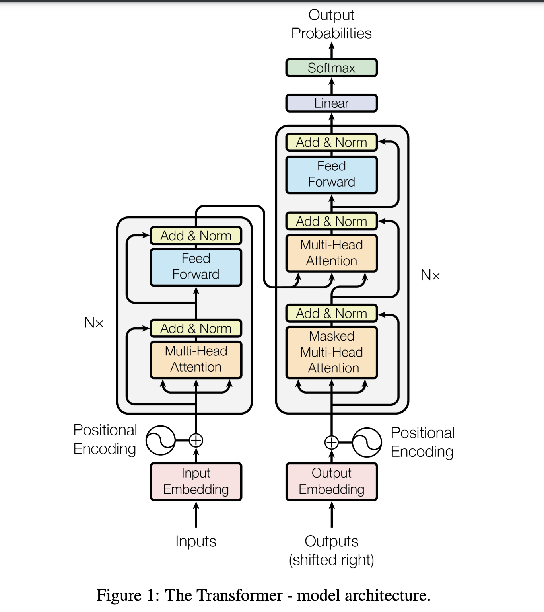
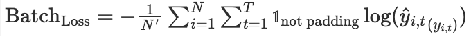

# **English-to-Indic Translator using Transformer from Scratch in PyTorch (v2)**  

[](https://www.python.org/downloads/release/python-312/)
[](https://pytorch.org/)
[](https://opensource.org/licenses/MIT)
[](https://huggingface.co/datasets/ai4bharat/samanantar)

Building on my previous **character-level Transformer** for translation in PyTorch ([repo here](https://github.com/bnarath/transformer-from-scratch)), this project enhances the approach by incorporating **Byte Pair Encoding (BPE) tokenization**.  

## **Why BPE?**  
While character-level translation limits vocabulary size, it often **stretches sentences in the context window**, making learning difficult. BPE compresses sentences to a **subword level**, improving efficiency while maintaining more content in the context. The **tokenizer is trained separately** and later integrated into the translator.  

## **Project Highlights**  
✅ **End-to-End Transformer Implementation** from scratch in PyTorch  
✅ **English-to-Malayalam Translation** (an Indic language)  
✅ **Subword Tokenization with BPE**, improving model efficiency  
✅ **GPU-Optimized Training** for enhanced performance  
✅ **Custom Architecture & Training from Scratch**  
✅ **Monitoring with TensorBoardX** for tracking training progress, model metrics, and performance tuning  

I chose **Malayalam** for this project as it is my native language and presents unique linguistic challenges in translation.  


## Technical Deep Dive

### 1. Data Preprocessing

**Dataset:** The `ai4bharat/samanantar` dataset from HuggingFace was used, containing approximately 5 million English-Malayalam sentence pairs. This dataset consists of English-to-Indic language pairs, specifically designed for machine translation tasks. For resource efficiency, I’ve limited the dataset to approximately 1 million pairs for training and 100K for validation to reduce  the training cost. (if you have resources, better use the entire data)

### 2. Tokenization

Every printable character in any language has a unique Unicode code point. There are about [**155K Unicode code points**](https://en.wikipedia.org/wiki/List_of_Unicode_characters). These code points can be encoded using UTF-8, UTF-16, or UTF-32. Among them, **UTF-8** is the most efficient because it uses **1 byte** for ASCII characters, while other characters can take up to **3 bytes**.  
    
We begin by converting the UTF-8 bytes into integers as the starting tokens. Our initial vocabulary size will be **256** since each byte is represented by 8 bits, and there are **2^8 = 256** possible values.  

The target vocabulary size is fixed at **500**. This means we will add 254 more tokens (and stop the process). In practice, this can be set to a much larger number, such as **50K** (this is a hyperparameter).  

*Note: GPT-4 utilizes a tokenizer known as **cl100k_base**, which includes about **100K tokens**.

**Byte Pair Encoding (BPE)**  
BPE works in two main steps:
1. **Find the most frequent consecutive token pairs**.
2. **Assign a new token ID** to the pair and replace any subsequent occurrences of the original tokens with the new ID.

With each merge, the vocabulary grows, and the corpus is compressed.  

Once the BPE model is trained, we create the token encoder and decoder based on the learned mappings. I have learned BPE using the entire training data and apply it to the validation and test sets.


## 3. Transformer Architecture
This section explains the components of the Transformer architecture used for this project.


*Figure 1: Image courtesy of [Original Transformer Paper](https://arxiv.org/pdf/1706.03762).*  

### Citation

If you use this project or related methods, please cite the [original Transformer paper](https://arxiv.org/pdf/1706.03762):

```bibtex
@inproceedings{vaswani2017attention,
  title={Attention is all you need},
  author={Vaswani, Ashish and Shazeer, Noam and Parmar, Niki and Uszkoreit, Jakob and Jones, Llion and Gomez, Aidan N and Kaiser, Łukasz and Polosukhin, Illia},
  booktitle={Advances in Neural Information Processing Systems (NeurIPS)},
  volume={30},
  year={2017}
}
```

### Key Layers & Features used across Encoder and Decoder

- **Embedding Layer:**
  - The input tokens are converted into 512-dimensional vectors using an embedding layer with learnable weights. The embedding dimension is defined as $d_{model} = 512$. Total vectors = Total vocabulary size = Total Tokens (500) + Num of Special Tokens (3).

- **Positional Encoding:**
  - Positional encoding is added to the input embeddings to provide information about the position of tokens in the sequence. 
   
  $\text{PE}(pos, 2i) = \sin\left( \frac{pos}{10000^{2i/d}} \right)$

  $\text{PE}(pos, 2i+1) = \cos\left( \frac{pos}{10000^{2i/d}} \right)$

  Where:
  - $pos$ is the position of the token in the sequence (starting from 0).
  - $i$ is the index of the dimension (for each position in the encoding vector).
  - $d$ is the total dimensionality of the positional encoding (same as the embedding dimension = $512$).
  This is similar to sampling d waveforms of decreasing frequencies at max sequence length positions.

- **Multi-Head Attention:**
  - The attention mechanism allows the model to focus on different parts of the input sequence. This model uses 8 attention heads. It is similar to where to focus on different aspect of language. 

  2 types of attention
  - Self Attention: Used in both Encoder and Decoder
  - Decoder - Encoder Cross Attention: Used in Decoder

- **Attention (Scaled Dot-Product Attention):**
  - The attention mechanism computes a weighted sum of values (V) based on the similarity between the query (Q) and the key (K). The formula for this is:

    $\text{Attention}(Q, K, V) = \text{softmax}\left(\frac{QK^T}{\sqrt{d_k}}\right)V$

    - $Q$: Query matrix (What am I looking for?). 
    - $K$: Key matrix (What do I have). 
    - $V$: VAlue matrix (What do I offer)

      - The size of $Q$, $K$ and $V$ is:[batch\_size, num\_heads, seq\_len, $d_k$]
    
    - The softmax function is applied to ensure the attention weights sum to 1.

- **Masked Attention**

    $\text{Masked Attention}(Q, K, V) = \text{softmax}\left(\frac{QK^T}{\sqrt{d_k}} + M\right)V$

    - The mask is represented as a large negative value (typically $-\infty$) at positions that need to be masked, and 0 at all other positions.

    - Both the encoder and decoder incorporate a padding mask. This is necessary because the input sequences are padded to a fixed length, matching the maximum sequence length. As a result, the model should ignore the padding tokens, ensuring that they neither attend to other tokens nor are attended to.

    - In the decoder, a "no-look-ahead" mask is used. This ensures that each token can only attend to tokens that have occurred before it, effectively masking any tokens that come after it in the sequence.

  
- **Feed-Forward Network:**
  - The encoder consists of a feed-forward network with one hidden layer containing 2048 neurons and uses ReLU as the activation function.
  
- **Layer Normalization:**
  - Layer normalization is applied to stabilize and speed up training, as described in the original Transformer paper. We normalize the layer's activations (neurons). It stabilizes training by ensuring the activations have a consistent scale and distribution, which can improve convergence speed.

  Given an input vector $f(x) = [x_1, x_2, ..., x_d]$ (where  d is the number of features):

  1. **Compute the mean and variance** of the input across the features:
    $\mu = \frac{1}{d} \sum_{i=1}^{d} x_i$

    $\sigma^2 = \frac{1}{d} \sum_{i=1}^{d} (x_i - \mu)^2$

  2. **Normalize the input**:
    $\hat{x_i} = \frac{x_i - \mu}{\sqrt{\sigma^2 + \epsilon}}$
    Where $\epsilon$  is a small constant added for numerical stability.

  3. **Scale and shift** the normalized output using learnable parameters $ \gamma $(scale)$ and $\beta$ (shift):
    $y_i = \gamma \hat{x_i} + \beta$


  
- **Residual Connections:**
  - The architecture incorporates residual connections, ensuring that gradients can flow easily through the network during backpropagation, mitigating the issue of vanishing gradients.


### **Training:**
- **Loss Function:**
  - The model uses cross-entropy loss, which is calculated between the predicted token probabilities and the actual target tokens.
  
    - In case of training, english words are tokenized without \<START\> , \<END\>
    - Malayalam words are tokenized with \<START\> but no \<END\>
    - Real labels are tokenized without \<START\> but with \<END\>
    - Cross entropy loss does not include loss from \<PAD\> tokens. 


    The **Cross-Entropy Loss** for a batch of tokens is calculated as the sum of individual losses for each token, excluding padding tokens. The formula for calculating the cross-entropy loss for a single token $t$ in sequence $i$ is:

    Where:
    - $\hat{y}_{i,t}$ is the predicted probability distribution over the vocabulary for the $t$-th token in sentence $i$ (after applying softmax).
    - $y_{i,t}$ is the true class (or the correct token) at position $t$ in sequence $i$.


    For a batch of size $N$, the total loss is the sum of the losses for all tokens in the batch, ignoring padding tokens. Padding tokens are excluded by setting their contribution to 0 in the loss calculation. The final formula for the batch loss is:

    

    Where:
    - $N$ is the batch size,
    - $T$ is the sequence length (number of tokens in each sentence),
    - $N'$ is the total number of non-padded tokens in the batch,
    - $\mathbb{1}_{\text{not padding}}$ is an indicator function that is 1 if the token is not padding and 0 if it is padding.


- **Optimizer:**
  - The Adam optimizer is used with it's default learning rate to minimize the loss function.
  

## 4. Implementation Details
- Step1: Preprocessor.process:
  - Retrieve the raw data.
  - Split the raw train/test/validation data and save these as files.
  - Discard invalid data where either src or tgt is not UTF-8 encodable.
  - Perform BPE training using the training data.
  - Save the BPE vocabulary map, reverse map, and related files for later use.

- Step1: Translator.build()
  - tbd


## 5. To Run:
```
# Clone the Repository:
git clone https://github.com/bnarath/transformer-from-scratch.git

# Navigate to the Project Directory
cd transformer-from-scratch

# Setup env
PYENV_VERSION=3.12.7 python -m venv env ; source env/bin/activate  # For Linux/macOS

# Install Package
pip install .

# Run the training using
sh run.sh
```


### Courtesy
I would like to express my gratitude to the following sources for their inspiration and educational content:

- [StatQuest with Josh Starmer's Transformer Series](https://www.youtube.com/watch?v=zxQyTK8quyY)
- [Andrej Karpathy's video series on Tokenizers](https://www.youtube.com/andrejkarpathy)
- [CodeEmporium's Transformer Series](https://www.youtube.com/watch?v=Xg5JG30bYik&list=PLTl9hO2Oobd97qfWC40gOSU8C0iu0m2l4&index=11)

### Contact
[](https://www.linkedin.com/in/bincynarath/)

### License
[](https://opensource.org/licenses/MIT)
